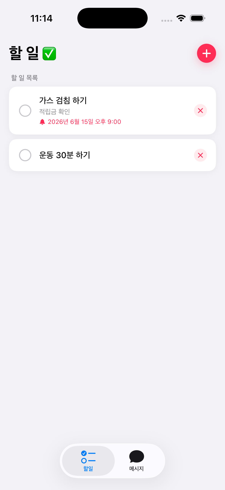
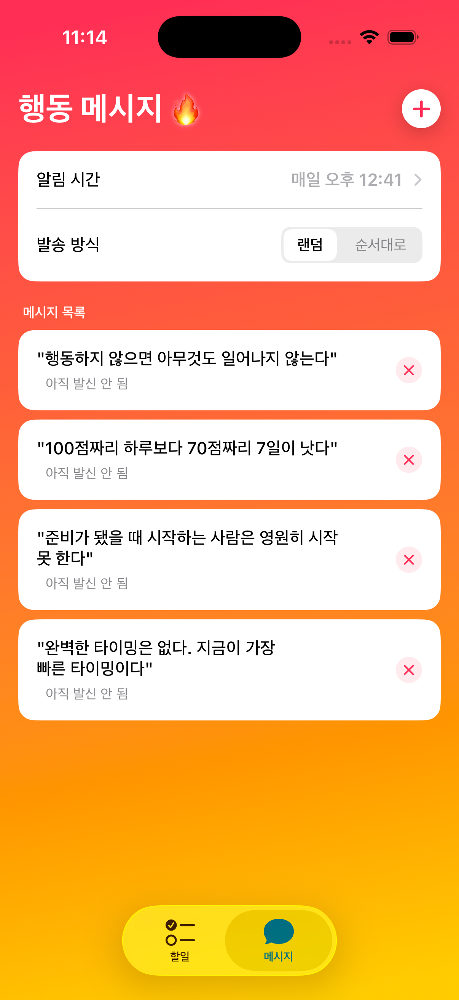
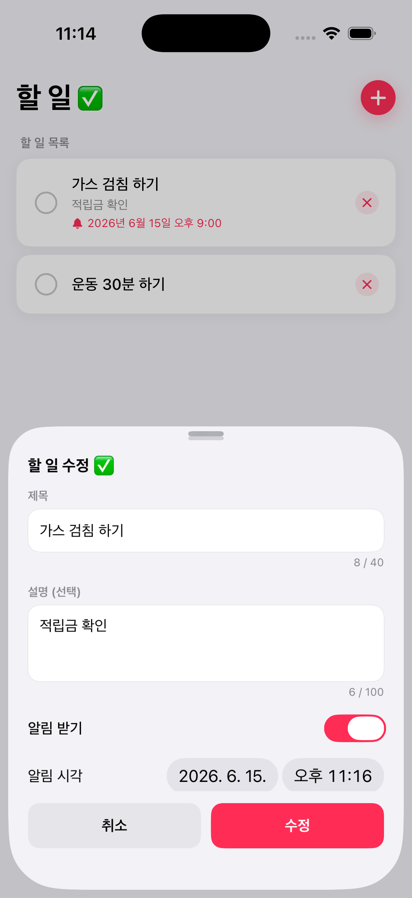
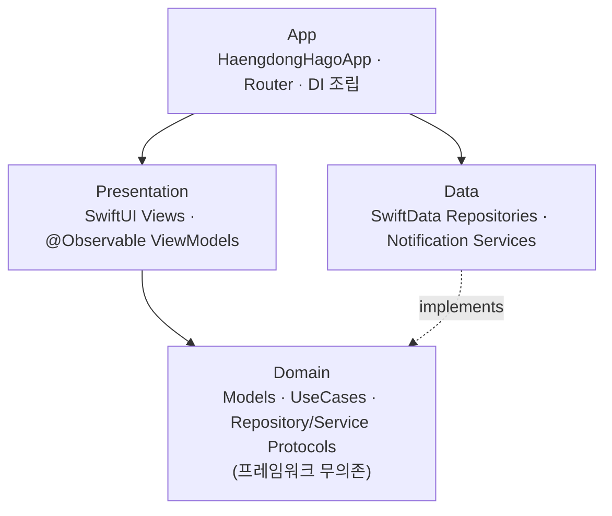

# HaengdongHago (행동하고)

> "행동하지 않으면 아무것도 일어나지 않는다." — 매일 한 줄의 동기부여 메시지와 마감 알림 할 일로 **실행**을 돕는 iOS 앱

[](https://github.com/Faucon130111/HaengdongHago-portfolio/actions/workflows/ci.yml)


---

## 📌 앱 소개

**행동하고**는 "결심"을 "행동"으로 옮기도록 돕는 작은 습관·동기부여 앱입니다.

- 직접 등록한 **행동 메시지** 중 하나를 매일 정해진 시각에 푸시 알림으로 받습니다.
- **할 일**에 마감일과 알림을 걸어, 미루지 않고 제때 실행하도록 리마인드합니다.

외부 라이브러리 없이 **SwiftUI · SwiftData · Swift Concurrency** 등 애플의 최신 프레임워크만으로
**Clean Architecture**를 적용해 구현한 개인 포트폴리오 프로젝트입니다.

---

## ✨ 주요 기능

| 기능 | 설명 |
|------|------|
| **할 일** | 제목·상세·마감일 등록, 완료 토글, 마감 시각 로컬 알림. 미완료 우선 → 마감 빠른 순 → 완료는 맨 아래로 자동 정렬 |
| **행동 메시지** | 동기부여 문구를 직접 추가/수정/삭제. 매일 1개를 알림으로 발송 (랜덤 / 순차 모드 선택) |
| **알림 설정** | 매일 발송 시각(시·분)과 발송 방식(랜덤·순차) 설정. 변경 즉시 향후 알림 재예약 |

> 첫 실행 시 기본 메시지가 자동으로 채워지고, 앱을 다시 켤 때 필요하면 알림이 자동 재예약됩니다.

---

## 📱 스크린샷

| 할 일 | 메시지 · 알림 설정 | 할 일 편집 |
|:---:|:---:|:---:|
|  |  |  |

<!-- 스크린샷 파일을 docs/screenshots/ 에 todo.png · message.png · edit.png 로 저장하면 위 표에 자동 반영됩니다. -->

---

## 🛠 기술 스택

- **UI**: SwiftUI (`NavigationStack`, `TabView`)
- **상태 관리**: Observation 프레임워크 (`@Observable`, `@MainActor`)
- **영속성**: SwiftData (`@Model`)
- **동시성**: Swift Concurrency (`async`/`await`)
- **알림**: UserNotifications (로컬 푸시)
- **로깅**: `os.Logger` (통합 로깅)
- **테스트**: Swift Testing (`@Test` / `#expect`)
- **코드 품질**: SwiftLint · SwiftFormat
- **외부 의존성**: 없음 (순수 Apple 프레임워크)

---

## 🏗 아키텍처

**Clean Architecture**를 적용해 `Presentation` → `Domain` ← `Data` 방향으로 의존성을 정리했습니다.
`Domain` 레이어는 어떤 프레임워크에도 의존하지 않는 순수 Swift 코드로, 비즈니스 규칙과
저장소/서비스 **프로토콜**만 정의합니다. `Data` 레이어가 그 프로토콜을 SwiftData·UserNotifications로
구현하고, `App` 레이어가 구체 타입을 조립(주입)합니다.



### 설계 포인트

1. **의존성 역전 (DIP)** — `Domain`이 `TodoRepository`, `NotificationServiceProtocol` 등 프로토콜만 정의하고
   `Data`가 이를 구현. 도메인 로직을 SwiftData/UserNotifications와 분리해 독립적으로 테스트할 수 있습니다.
2. **수동 생성자 주입 (DI)** — DI 프레임워크 없이 `HaengdongHagoApp.init()` 한 곳에서 의존성을 조립.
   의존 관계가 한눈에 보이고, 테스트에서는 Fake/Spy 더블로 손쉽게 교체합니다.
3. **순수 함수로 분리한 알림 스케줄링** — `MotivationScheduler.plan()`이 "어떤 메시지를 언제 보낼지"를
   부수효과 없이 계산해 `[PlannedNotification]`을 반환하고, `Data` 레이어는 그 결과를 등록만 합니다.
   정책 로직을 순수 함수로 떼어내 단위 테스트가 쉽습니다.
4. **결정적 랜덤 발송** — 랜덤 모드는 주(week) 시드 기반 `SeededRandomNumberGenerator`(xorshift64)로
   셔플하여, 같은 주에는 항상 같은 순서로 노출됩니다. 재현 가능하고 테스트 가능합니다.
5. **`@Observable` ViewModel** — iOS 17 Observation으로 보일러플레이트 없는 상태 관리,
   `@MainActor`로 UI 스레드 안전성을 보장합니다.
6. **알림 제약 고려** — iOS의 보류 알림 64개 제한을 감안해 30일치를 미리 예약하고,
   앱이 포그라운드로 돌아올 때 `RescheduleIfNeededUseCase`로 필요 시 재예약합니다.

---

## 📂 프로젝트 구조

```
HaengdongHago/
├── App/             # 앱 진입점, 라우팅, 의존성 조립 (DI)
├── Core/            # 공용 유틸 (Logger, Preview 컨테이너)
├── Domain/          # 비즈니스 로직 (프레임워크 무의존)
│   ├── Model/       # Todo, ActionMessage, NotificationSetting
│   ├── Repository/  # 저장소 프로토콜
│   ├── Service/     # MotivationScheduler 등 정책 / 프로토콜
│   └── UseCase/     # TodoUseCase, MessageUseCase, NotificationSettingUseCase ...
├── Data/            # 구현 레이어
│   ├── Entity/      # SwiftData @Model 엔티티
│   ├── Repository/  # SwiftData 저장소 구현
│   └── Notification/# UserNotifications 서비스 구현
└── Presentation/    # SwiftUI 화면 + @Observable ViewModel
    ├── Todo/
    ├── Message/
    ├── Notification/
    └── Splash/
```

---

## ✅ 테스트

핵심 도메인·UseCase 로직을 **Swift Testing**으로 검증합니다. 저장소/알림 서비스는 인메모리
Fake·Spy 더블(`TestDoubles.swift`)로 대체해 부수효과 없이 빠르게 실행됩니다.

- `TodoUseCaseTests` — 할 일 CRUD 및 알림 등록/취소 규칙
- `MessageUseCaseTests` — 메시지 CRUD 및 재예약 트리거
- `MotivationSchedulerTests` — 랜덤/순차 발송 정책 (파라미터화 테스트)
- `RescheduleIfNeededUseCaseTests` — 재예약 조건 분기

실행: Xcode에서 **⌘U**, 또는

```bash
xcodebuild test \
  -project HaengdongHago.xcodeproj \
  -scheme HaengdongHago \
  -destination 'platform=iOS Simulator,name=iPhone 16'
```

---

## 🚀 빌드 및 실행

**요구 사항**: Xcode 16+ / iOS 17.0+

```bash
git clone https://github.com/Faucon130111/HaengdongHago-portfolio.git
cd HaengdongHago-portfolio
open HaengdongHago.xcodeproj
```

Xcode에서 `HaengdongHago` 스킴을 선택하고 시뮬레이터 또는 기기에서 실행(**⌘R**)합니다.
별도 의존성 설치 과정은 없습니다.
